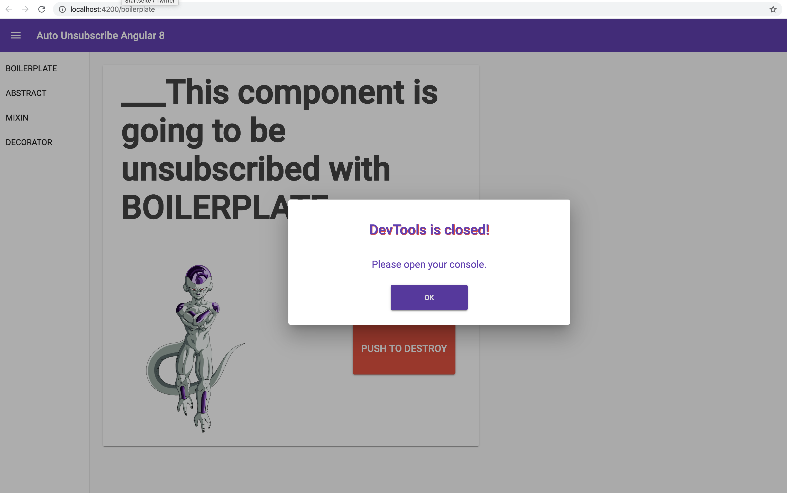

# How to unsubscribe in Angular 8
This project was generated with [Angular CLI](https://github.com/angular/angular-cli) version 8.3.24.

## Up and running

```bash
npm i
npm start
```

Navigate to `http://localhost:4200/`. The app will automatically reload if you change any of the source files.

## Freezer, the destroyer of components

Once you load the app in your browser you should see something like this:



There is a service implemented that checks whether DevTools is open or not. You need it open in order to test the destruction and consequent unsubscription of components that were previously subscribed to observables.

Click on OK and open DevTools console. Now you should see the emission of a counter every second:


If you click on PUSH TO DESTROY Freezer will take care of destroying the current component by navigating to a `DestroyedComponent`.


As you can see the count stops. That means that our observable was unsubscribed. Also `this.subscription$$.closed` outputs `true`. That means that we included an extra action to check on the `subscription$$` inside the `ngOnDestroy()` method.

```ts
import { ChangeDetectionStrategy, Component, OnDestroy, OnInit } from '@angular/core';
import { interval, Observable, Subject, Subscription } from 'rxjs';
import { takeUntil, tap } from 'rxjs/operators';

@Component({
  changeDetection: ChangeDetectionStrategy.OnPush,
  templateUrl: './boilerplate.component.html',
})
export class BoilerplateComponent implements OnInit, OnDestroy {
  destroyed$ = new Subject<void>();
  observable$: Observable<number> = interval(1000);
  subscription$$: Subscription;

  ngOnInit(): void {
    this.subscription$$ = this.observable$
      .pipe(tap(console.log), takeUntil(this.destroyed$))
      .subscribe();
  }

  ngOnDestroy(): void {
    this.destroyed$.next();
    // Any extra actions:
    console.log('this.subscription$$.closed in ngOnDestroy:::', this.subscription$$.closed);
  }
}
```
